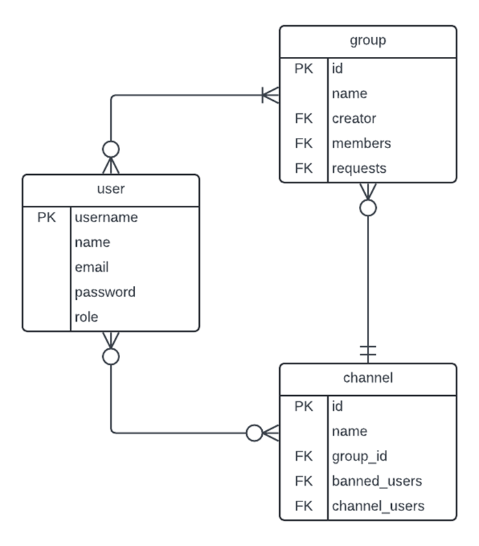

# 3813ICT Assignment: Cloud Connect by Thwin

## Introduction

This is a project developed as an assessment for 3813 ICT named Cloud Connect. The frontend is developed using Angular (v20.1.3) in typescript and html while the backend is developed using Node.js (v22.17.0) and Express. In the current phase, the data stored in the txt.file in JSON format.

To start a local development server for frontend, from root folder run:

```bash
npm install
ng serve
```

To start the server backend, from server folder run:

```bash
npm install
nodemon server.js
```

Once the server is running, open your browser and navigate to `http://localhost:4200/`.

## Git Repository

This repository contains both frontend (Angular) and backend (Node.js) of the project in order to keep everything simple and organized. The server exists on the same root level as the client src folder to achieve mono-repo design of the project. <br> <br>
Currently, there are total of 4 branches in the repo namely main, dev, feature/login and feature/home. Each feature is branched and developed separately as feature/feature-name and merged into dev branch for testing. The main branch on the other hand is an always stable and deployable version of the project and no commit was pushed directly into main branch apart from the first initial commit. <br> <br>
Commits were regularly pushed during development. Frontend commits were more frequent due to UI tweaks and component adjustments while backend commit were done after every 1 to 2 developments of API routes or together with the frontend component that is making used of the route as I usually tend to test and make sure they were as bug free as possible before commits. <br> <br>
Package folder such as node_modules and server/node_modules were added into gitignore, as well as data folder to avoid polluting the git history with constant meaningless changes.

## Data Structure


I used the minimal and clean data model to structure the project. For the current version there are 3 main entities in the project ERD namely user, group and channel. User has username as unique primary key and the other necessary fields. Group has id as primary key along with foreign keys of User such as creator, members and requests. For Channel, id act as primary key with group_id foreign key from Group, banned_users and channel_users from User. All of these entities have many-to-many relationships with each other meaning for future development with mongo db, it is required to develop 3 bridging tables between them to further reinforce the data structure as well as other helpful entities such as role.

## Server-side Classes

The followings are core entities implemented in the backend of the project. <br>

**User**: This class represent the User entity with same attributes apart from valid for authentication. All of the attributes are strings.

```
class User {
  constructor(username, name, email, password, role, groups = [], valid) {
    this.username = username;
    this.name = name;
    this.email = email;
    this.password = password;
    this.role = role;
    this.valid = valid;
  }
}
```

Example record from /data/user.txt

```
{
    "username": "super",
    "name": "Super",
    "email": "super@com",
    "password": "123",
    "role": "super-admin"
}
```

**Group**: This class represents the Group entity with more restricted rules. Id, name, creator are all strings while members and requests are array of usernames (strings). The entries from members and requests are mutually exclusive.

```
class Group {
  constructor(id, name, creator_username, members = [], requests = []) {
    this.id = id;
    this.name = name;
    this.creator = creator_username;
    this.members = members;
    this.requests = requests;
  }
}
```

Example record from /data/group.txt

```
{
    "id": "g001",
    "name": "General",
    "creator": "super",
    "channels": ["c001", "c002", "c010", "c011"],
    "members": ["juno", "momo", "super", "aj"],
    "requests": ["kira", "max"]
  }

```

**Channel**: This class represents the Channel entity with id, name and group_id being strings. Banned_users and channel_users are array of usernames (strings) similar to previous they are also mutually exclusive.

```
class Channel {
  constructor(id, name, group_id, banned_users = [], channel_users = []) {
    this.id = id;
    this.name = name;
    this.group_id = group_id;
    this.banned_users = banned_users;
    this.channel_users = channel_users;
  }
}
```

Example record from /data/channel.txt

```
{
    "id": "c001",
    "name": "Lobby",
    "group_id": "g001",
    "banned_users": ["juno"],
    "channel_users": ["momo", "super", "aj"]
  }

```
### Client-Side Models
The following are the models based on the ERD entities. Some fields in these models are set as optional to ensure the reusability of the model for both authentication, permission and basic data transfer.

User: This is the model of User entity used for login, group membership display, user management, group management and channel management.

export class User {
  username: string;
  name: string;
  email?: string;
  role: string;
  valid?: boolean;
}

**Group**: This is the model of Group entity used for group management and basic group display.
```
export class Group {
  id?: string;
  name: string;
  creator?: string;
  channels?: string[];
  members?: any[];
  requests?: any[];
}
```
**Channel**: This is the model of Channel entity used for channel display and channel management.
```
export class Channel {
  id?: string;
  name: string;
  group_id?: string;
  banned_users?: any[];
  channel_users?: any[];
  newly_added?: boolean;
}
```
**Groups**: This is the extended model of Group entity for group search feature where it is required to send limited information to frontend such as channel count instead of all channel id and member count instead of all member usernames.
```
export class Groups {
    id: string;
    name: string;
    creator: string;
    isAdmin: boolean;
    isMember: boolean;
    channelCount: number;
    memberCount: number;
    requests?: any[];
}
```
