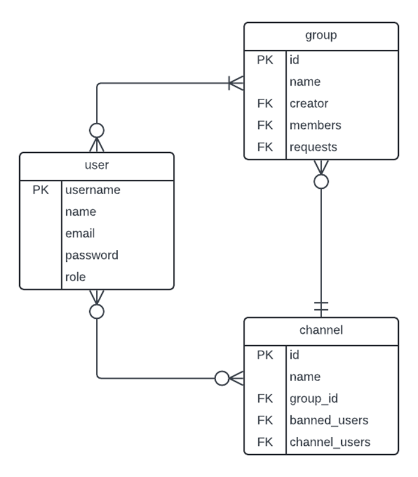
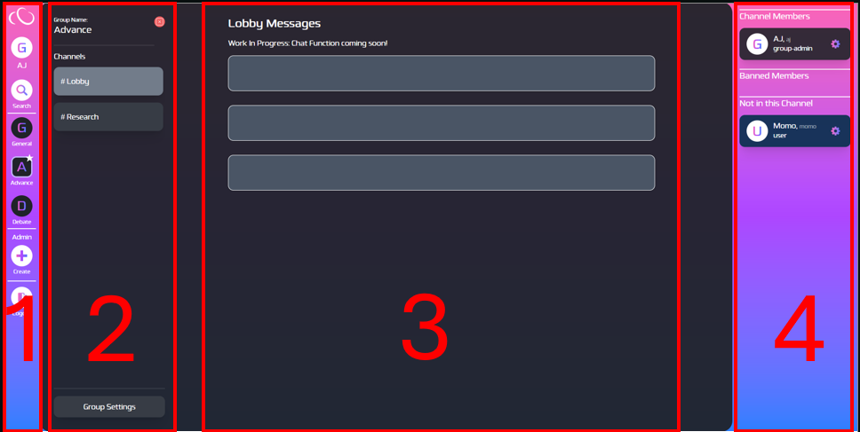

# 3813ICT Assignment: Cloud Connect by Thwin

## Introduction

This is a project developed as an assessment for 3813 ICT named Cloud Connect. The frontend is developed using Angular (v20.1.3) in typescript and html while the backend is developed using Node.js (v22.17.0) and Express. In the current phase, the data stored in the txt.file in JSON format.

To start a local development server for frontend, from root folder run:

```bash
npm install
ng serve
```

To start the server backend, from server folder run:

```bash
npm install
nodemon server.js
```

Once the server is running, open your browser and navigate to `http://localhost:4200/`.

## Git Repository

This repository contains both frontend (Angular) and backend (Node.js) of the project in order to keep everything simple and organized. The server exists on the same root level as the client src folder to achieve mono-repo design of the project. <br> <br>
Currently, there are total of 4 branches in the repo namely main, dev, feature/login and feature/home. Each feature is branched and developed separately as feature/feature-name and merged into dev branch for testing. The main branch on the other hand is an always stable and deployable version of the project and no commit was pushed directly into main branch apart from the first initial commit. <br> <br>
Commits were regularly pushed during development. Frontend commits were more frequent due to UI tweaks and component adjustments while backend commit were done after every 1 to 2 developments of API routes or together with the frontend component that is making used of the route as I usually tend to test and make sure they were as bug free as possible before commits. <br> <br>
Package folder such as node_modules and server/node_modules were added into gitignore, as well as data folder to avoid polluting the git history with constant meaningless changes.

## Data Structure

<br>

I used the minimal and clean data model to structure the project. For the current version there are 3 main entities in the project ERD namely user, group and channel. User has username as unique primary key and the other necessary fields. Group has id as primary key along with foreign keys of User such as creator, members and requests. For Channel, id act as primary key with group_id foreign key from Group, banned_users and channel_users from User. All of these entities have many-to-many relationships with each other meaning for future development with mongo db, it is required to develop 3 bridging tables between them to further reinforce the data structure as well as other helpful entities such as role.

## Server-side Classes

The followings are core entities implemented in the backend of the project. <br>

**User**: This class represent the User entity with same attributes apart from valid for authentication. All of the attributes are strings.

```
class User {
  constructor(username, name, email, password, role, groups = [], valid) {
    this.username = username;
    this.name = name;
    this.email = email;
    this.password = password;
    this.role = role;
    this.valid = valid;
  }
}
```

Example record from /data/user.txt

```
{
    "username": "super",
    "name": "Super",
    "email": "super@com",
    "password": "123",
    "role": "super-admin"
}
```

**Group**: This class represents the Group entity with more restricted rules. Id, name, creator are all strings while members and requests are array of usernames (strings). The entries from members and requests are mutually exclusive.

```
class Group {
  constructor(id, name, creator_username, members = [], requests = []) {
    this.id = id;
    this.name = name;
    this.creator = creator_username;
    this.members = members;
    this.requests = requests;
  }
}
```

Example record from /data/group.txt

```
{
    "id": "g001",
    "name": "General",
    "creator": "super",
    "channels": ["c001", "c002", "c010", "c011"],
    "members": ["juno", "momo", "super", "aj"],
    "requests": ["kira", "max"]
  }

```

**Channel**: This class represents the Channel entity with id, name and group_id being strings. Banned_users and channel_users are array of usernames (strings) similar to previous they are also mutually exclusive.

```
class Channel {
  constructor(id, name, group_id, banned_users = [], channel_users = []) {
    this.id = id;
    this.name = name;
    this.group_id = group_id;
    this.banned_users = banned_users;
    this.channel_users = channel_users;
  }
}
```

Example record from /data/channel.txt

```
{
    "id": "c001",
    "name": "Lobby",
    "group_id": "g001",
    "banned_users": ["juno"],
    "channel_users": ["momo", "super", "aj"]
  }

```
### Client-Side Models
The following are the models based on the ERD entities. Some fields in these models are set as optional to ensure the reusability of the model for both authentication, permission and basic data transfer.

User: This is the model of User entity used for login, group membership display, user management, group management and channel management.

export class User {
  username: string;
  name: string;
  email?: string;
  role: string;
  valid?: boolean;
}

**Group**: This is the model of Group entity used for group management and basic group display.
```
export class Group {
  id?: string;
  name: string;
  creator?: string;
  channels?: string[];
  members?: any[];
  requests?: any[];
}
```
**Channel**: This is the model of Channel entity used for channel display and channel management.
```
export class Channel {
  id?: string;
  name: string;
  group_id?: string;
  banned_users?: any[];
  channel_users?: any[];
  newly_added?: boolean;
}
```
**Groups**: This is the extended model of Group entity for group search feature where it is required to send limited information to frontend such as channel count instead of all channel id and member count instead of all member usernames.
```
export class Groups {
    id: string;
    name: string;
    creator: string;
    isAdmin: boolean;
    isMember: boolean;
    channelCount: number;
    memberCount: number;
    requests?: any[];
}
```
## Angular Architecture
### Components
Components are the core building block of an angular project like this that hold the visual template (HTML) and behaviours (Typescript). They are located in the /src/app/components folder. There are 2 main components representing 2 main pages of the website along with many other sub-components and the architecture of this project is expressed below.
```
components/
	login/
	dashboard/
		account-settings/
		channelbar/
		chat/
		group-form/
		group-search/
		groupbar/
		memberbar/
		user-manager/
```
Login is the starting page of the website where users can login or sign up. After that user will be taken to the main landing page called dashboard.

 <br>

The dashboard is the melting pot of all other components. Dashboard layout can be divided into 4 different sections.<br>

Section 1 is the main navigation bar also known as groupbar. It can help users navigate around all the features of this website. For normal users, they will have access to account-settings, search-group, individual groups, and log out. For group admin, they have access to create new groups from group-form and for super, they have exclusive access to user-management.<br>

Section 2 and 3 can change depending on what page user is on but mainly, section 2 will hold all the available channels of the selected group and section 3 display the chat functionality which is not implemented yet for current version. If the user is an admin, they also have ability to edit the group information as well as managing users for the group via group settings button in Section 2.<br>

Section 4 is the memberbar where it displays the members that the currently opened channel has. For admins, they can also see and banned member and group members that are not currently in the channels. They can also do actions such as ban from channel, remove from channel and kick from group.

### Services
Services are singleton classes that can be called upon by any component to perform application logic or communicate with backend. There are 2 key services in this project namely http.service and data.service. The following is the folder structure of services.
```
services/
	data.service.spec.ts
	data.service.ts
	http.service.spec.ts
	http.service.ts
```
http.service is to handle login and register functions for user accounts.<br>

Example http.service function
```
  login(username: string, password: string): Observable<User | { valid: false }> {
    return this.httpService.post<User | { valid: false }>(
      `${this.server}/auth`,
      {
        username,
        password,
      }
    );
  }
```
data.service handle data transfer process and the main communicator between frontend and backend. It can request, delete and modify the information about users, groups and channels.

Example data.service function
```
getGroup(group_id: string) {
    return this.httpService.get<Group>(
      `${this.server}/group/${group_id}`,
      {
        headers: this.attachHeader(),
      }
    );
  }
```
### Models
Models can be used to enforce types to ensure the alignment of data transferred between frontend and backend as well as data communication between components. The following is the folder structure of models.
```
models/
	channel.spec.ts
	channel.ts
	group.spec.ts
	group.ts
	groups.spec.ts
	groups.ts
	user.spec.ts
	user.ts
```
In this project, there are 4 models in total.<br>
**User**: an individual user on the website. <br>
**Group**: a collection of users managed by a creator <br>
**Channel**: a discussion space where users can chat and communicate <br>
**Groups**: a filtered, safe for everyone version of Group mainly to prevent the data leak to unauthorized users.<br>

Example service restricted to only accept array of Channel models from backend
```
  getChannels(group_id: any) {
    return this.httpService.get<Channel[]>(
      `${this.server}/groups/${group_id}/channels`,
      {
        headers: this.attachHeader(),
      }
    );
  }
  ```

Example service restricted to only accept array of User models from backend
  ```
  getMembers(group_id: any) {
    return this.httpService.get<User[]>(
      `${this.server}/groups/${group_id}/members`,
      {
        headers: this.attachHeader(),
      }
    );
  }
  ```

Example component restricted to only accept respective type from other components
```
  @Input() current_group: Group | null = null;
  @Input() all_users: User[] = [];
  @Input() channels: Channel[] = [];
  @Input() create_new: boolean = false;
```
### Routes
In this project, as we only have 2 main components, there is only 2 routes that is being used to navigate between those components. The first route is the default route when the page is loaded into localhost:4200. The second route is to direct to dashboard after authentication.
```
{
  path: '',
  component: Login,
  title: 'Cloud Connect: Login',
},
{
  path: 'dashboard',
  component: Dashboard,
  title: 'Cloud Connect: Dashboard',
}
```

## Node Server Architecture
### Files and Modules
As the entry point to the server, server.js connect every other module together such as express, routes, listen port and socket. The file structure of the server can be expressed as below.
```
server/
    models/ 
        channel.js 
        groups.js 
        user.js 
    routes/ 
        api-auth.js 
        api-channels.js 
        api-groups.js 
        api-users.js 
    db-manage.js
    listen.js 
    mock.js 
    server.js 
    socket.js
```

First the models are the modules that I’ve already discussed about previously as they hold the classes that define the data structure on the server side. <br>

In routes, there is 4 modules, each with its own REST API routes to fulfil their functions. Login and registering new users are done via api-auth.js. In api-channel.js, hold routes that interact with channels such as delete, modify or create new channels while api-groups.js manage that aspect for groups. In api-users.js, it handles more than just user class, as it also deals with group creator, members and requested users as well as with channel for channel users and banned users. <br>

The db-manage.js hold functions to interact with save files while listen.js just hold the connection between server and port. Socket.js is for future real-time chat functionality and the mock.js is for the purpose of testing classes while they were being developed. <br>

### Functions 

There are only 3 functions in the server of this project namely, attachUser, writeJson and readJson.<br><br>
```function readJson(filePath) { . . . }```
This is a function that simply read the file from the filePath and parse it from Json to string and return it.<br>

```function writeJson(filePath, data) { . . . }```
This is also a simple function that write the input data into the file from the filePath and return true if successful.<br>

```function attachUser(req, res, next) { . . . }```
This function is useful for getting the information back from the frontend without having to rely on the http route every time. With my setup, I can used another function in the frontend to attachHeader with the current username and this attachUser grabs the header from the backend and return it. With this, I can verify every single request sent to backend via username and decide whether this current user should have the information or not.<br>

## Server-Side Routes

**Route**: ```POST /api/auth```
**Parameters**: username, password <br>
**Return values**: User object <br>
**Purpose**: to authenticate username and password and return user info which then saved into local storage.

**Route**: ```POST /api/auth/register```<br>
**Parameters**: username, name, email, role, password<br>
**Return values**: User object <br>
**Purpose**: to register a new user and return that user into which then saved into local storage.

**Route**: ```GET /api/groups/:group_id/members```<br>
**Parameters**: group_id <br>
**Return values**: members (User[]) <br>
**Purpose**: return all members (username, name, role) from a group.

**Route**: ```GET /api/groups/:group_id/requests```<br>
**Parameters**: group_id<br>
**Return values**: requests (User[]) <br>
**Purpose**: return all users who had requested to join a group.

**Route**: ```GET /api/channels/:channel_id/banned```<br>
**Parameters**: channel_id<br>
**Return values**: banned_users (User[]) <br>
**Purpose**: return all users who had been banned from a channel.

**Route**: ```GET /api/channels/:channel_id/members```<br>
**Parameters**: channel_id<br>
**Return values**: channel_users (User[]) <br>
**Purpose**: return all users who are the members of a channel.

**Route**: ```GET /api/users```<br>
**Parameters**: none<br>
**Return values**: User[] <br>
**Purpose**: return all users info except password, restricted to only super admins and group admins.

**Route**: ```DELETE /api/channel/:channel_id/members/:username```<br>
**Parameters**: channel_id, username<br>
**Return values**: Channel object <br>
**Purpose**: remove a user from a channel’s channel_users.

**Route**: ```PUT /api/channel/:channel_id/bans/:username```<br>
**Parameters**: channel_id, username<br>
**Return values**: Channel object <br>
**Purpose**: add a user to a channel’s banned_users, also remove from channel_users if present.

**Route**: ```PUT /api/channel/:channel_id/members/:username```<br>
**Parameters**: channel_id, username<br>
**Return values**: Channel object <br>
**Purpose**: add a user to a channel’s channel_users and remove from banned_users

**Route**: ```DELETE /api/user/:username```<br>
**Parameters**: username<br>
**Return values**: confirmation ([string]) <br>
**Purpose**: delete a user from database also remove from other possible places in group and channel.

**Route**: ```PATCH /api/user/:username/role```<br>
**Parameters**: username<br>
**Return values**: User object <br>
**Purpose**: promote a user to another possible role, user to group-admin to super-admin

**Route**: ```GET /api/log```<br>
**Parameters**: none<br>
**Return values**: logs (string[]) <br>
**Purpose**: get ban logs only available for super-admin

**Route**: ```GET /api/groups```<br>
**Parameters**: none<br>
**Return values**: Group[] <br>
**Purpose**: get all groups only available for super-admin or filtered groups for others

**Route**: ```GET /api/group/:id```<br>
**Parameters**: id<br>
**Return values**: Group[] <br>
**Purpose**: get all info of a group for editing, only available for super admin and group creator

**Route**: ```GET /api/search/groups```<br>
**Parameters**: none<br>
**Return values**: Group[] <br>
**Purpose**: get all groups with filtered and generalized info to display them in group search for all users.

**Route**: ```POST /api/group/```<br>
**Parameters**: name, members, requests<br>
**Return values**: Group <br>
**Purpose**: create a new group and return that newly created group

**Route**: ```PUT /api/group/:id```<br>
**Parameters**: id, name members, requests<br>
**Return values**: Group <br>
**Purpose**: modify a group with new info and return that group

**Route**: ```DELETE /api/group/:id```<br>
**Parameters**: id<br>
**Return values**: confirmation ([string]) <br>
**Purpose**: delete a group from database

**Route**: ```DELETE /api/group/:id/member```<br>
**Parameters**: id<br>
**Return values**: confirmation ([string]) <br>
**Purpose**: remove a user(themselves) from a group

**Route**: ```PATCH /api/group/:id/request```<br>
**Parameters**: id<br>**: username <br>
**Purpose**: add a user(themselves) to a group’s requests

**Route**: ```GET /api/groups/:group_id/channels```<br>
**Parameters**: group_id<br>
**Return values**: Channels[]<br>
**Purpose**: return all channels of a group, filtered via their membership to the individual channels as well.

**Route**: ```POST/api/channel/:id```<br>
**Parameters**: id, name<br>
**Return values**: Channel<br>
**Purpose**: create a new channel in a group(id) using the name input

**Route**: ```DELETE/api/channel/:id```<br>
**Parameters**: id<br>
**Return values**: confirmation ([string])<br>
**Purpose**: delete a channel(id)


## Interaction between Client and Server

### Login
**Client to Server**: ```POST /api/auth/login { username, password }```<br>
**Server changes**: none<br>
**Client updates**: receive user data on success and store it in the local storage, then route to dashboard.

### Load Groups
**Client to Server**: ```GET /api/groups/```<br>
**Server changes**: none<br>
**Client updates**: populate those groups in the groupbar (navbar) allow for openGroup() function

### Open Group Load Channels
**Client to Server**: ```GET /api/groups/:group_id/channels```<br>
**Server changes**: none<br>
**Client updates**: receive the channels on open group and render them into channelbar.

### Create Group
**Client to Server**: ```POST /api/group/ { name, members, requests }```<br>
**Server changes**: push a new group to groups array and overwrite it to group.txt<br>
**Client updates**: receive new group data and perform openGroup which then Load Channels. Also updates the groupbar with newly created group

### Open Manage Group
**Client to Server**: ```GET /api/group/:id```<br>
**Server changes**: none<br>
**Client updates**: receive all data on the group that is being edited, Get All User and Get All Requested Users to populate the member management within Manage Group

### Save Changes on Group
**Client to Server**: ```PUT /api/group/:id { name, member, requests }```<br>
**Server changes**: push the modified group into groups array and overwrite it to group.txt<br>
**Client updates**: receive the modified group data and perform openGroup which then Load Channels

### Ban User from a Channel
**Client to Server**: ```PUT /api/channel/:channel_id/bans/:username```<br>
**Server changes**: push a user into channel.banned_user and remove from channel.channel_users, push that channel into channels and overwrite it into channel.txt<br>
**Client updates**: update the user interface for group-admin and super-admin to correctly show the banned users
